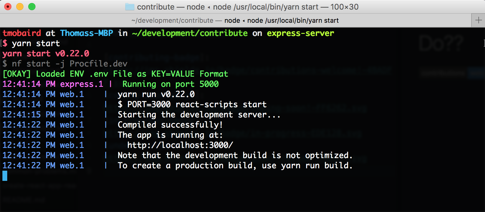

# What Does `yarn start` Really Do??

![Contributions Welcome][contributing-badge] ![Under Review][under-review-badge]

At the most basic level `yarn start` simply runs your application locally so you can access it (defaults to port 3000). In this doc, we'll dissect the `yarn start` to understand what in can do in more depth.

### `start` Script in package.json

When you run `yarn start` all that is really doing is running the `start` script that is defined in the [package.json](https://github.com/tmobaird/i-want-to-contribute/blob/master/package.json). Lets take a look at that script:

```
nf start -j Procfile.dev
```

**What's `nf`?** **What's Procfile.dev?**

`nf` is the command line tool that comes from the node library [foreman](https://github.com/strongloop/node-foreman).

> Foreman is a manager for Procfile-based applications. Its aim is to abstract away the details of the Procfile format, and allow you to either run your application directly or export it to some other process management format.

In short, the command above uses foreman [the node version] to run the file [Procfile.dev](https://github.com/tmobaird/i-want-to-contribute/blob/master/Procfile.dev).

**Procfiles** allow you to specify different processes that should be run. These processes are simple shell commands that would usually be executed directly in your terminal. The benefit on procfiles and foreman, is that they allow you to start multiple controlled processes at the same time with one foreman start command. Foreman is awesome :+1:.

_For more information about Procfiles and this project, check out the doc [Foreman and Procfiles](foreman-and-procfiles.md)_

### Taking A Look At the Procfile.dev

```
express: node src/server
web: yarn run start-ui
```

This is what the Procfile.dev looks like. The first line `express: node src/server` will create a process named `express` started by the command `node src/server`. The second line will create a process named `web` started by the command `yarn run start-ui`.

When this Procfile is run via foreman, both of these processes will start and run. This will start both the express server and the UI server so the app can be accessed!

### Running `yarn start`

`yarn start` is is where everything you've read in this doc finally comes together. This command runs our `Procfile.dev` with foreman to start two different processes:

1. Express Server
2. Web React App Server

These processes running at the same time make up a fully running local version of the application. When you run `yarn start` the output should look something like this:



If you look closely, you can see the pink text is console output for the express server process:

```
12:41:14 PM express.1 | Running on port 5000
```

The blue text, on the other hand, is the console output for the React web server:

```
12:26:37 AM web.1    |  $ PORT=3000 react-scripts start
12:26:38 AM web.1    |  Starting the development server...
12:26:46 AM web.1    |  Compiled successfully!
12:26:46 AM web.1    |  The app is running at:
12:26:46 AM web.1    |    http://localhost:3000/
12:26:46 AM web.1    |  Note that the development build is not optimized.
12:26:46 AM web.1    |  To create a production build, use yarn run build.
```

All of the console output from your application (both backend and frontend) will display here.

_**To quit or end your running servers, simply enter `ctrl + c` in your terminal window.**_

[&#x2190; Previous](setting-up-your-environment.md) | [Next Up: **Express Usage** &#x2192;](express-usage.md)

[contributing-badge]: https://img.shields.io/badge/contributions-welcome!-4BADFF.svg
[coming-soon-badge]: https://img.shields.io/badge/coming-soon!-FF6262.svg
[in-progress-badge]: https://img.shields.io/badge/in-progress-EDE128.svg
[under-review-badge]: https://img.shields.io/badge/under-review-C486FF.svg
